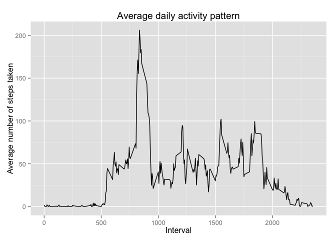
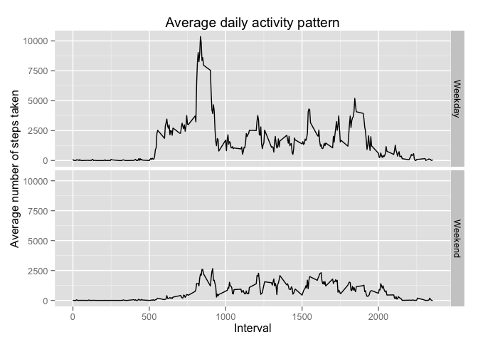

# Reproducible Research: Peer Assessment 1

Penalize scientific notation

```r
options("scipen" = 100)
```
## Loading and preprocessing the data

```r
activity <- read.csv('activity.csv')
```


## What is mean total number of steps taken per day?
First sum up steps taken per day after omitting records with no steps available.

```r
grpbyday <- aggregate(steps ~ date, data = activity[which(!is.na(activity$steps)),], sum)
```

Create histogram

```r
hist(grpbyday$steps)
```

 

The mean number of steps taken per day is 10766.1887

The median number of steps taken per day is 10765

## What is the average daily activity pattern?

Group the data by intervals and average the steps. Records with no step records available are omitted.

```r
grpbyinterval <- aggregate(steps ~ interval, data = activity[which(!is.na(activity$steps)),], mean)
```

Plot the graph using ggplot

```r
library(ggplot2)
qplot(x = interval, y = steps, data = grpbyinterval, geom = "line", main="Average daily activity pattern", xlab = "Interval", ylab = "Average number of steps taken")
```

 

Interval with the maximum number of average steps : 835

## Imputing missing values

1. Number of missing values in the data : 17568

2. Missing values will be filled with the rounded mean for that interval

3. Create new dataset with the missing values filled in

```r
new_data <- activity

NArecords <- which(is.na(new_data$steps))

for (i in NArecords) {
  new_data$steps[i] <- round(grpbyinterval$steps[grpbyinterval$interval == new_data$interval[i]])
}
```

4.i Sum the steps for each day

```r
new_grpbyday <- aggregate(steps ~ date, data = new_data, sum)
```

4.ii Plot histogram

```r
hist(new_grpbyday$steps)
```

 

4.iii Compare the mean with the one calculated in the part one.

Comparison of means:
 
 (a) Part one omitting NAs = 10766.1887  
 (b) Filled in missing values = 10765.6393  
 Difference (a - b) = 0.5493  
 
Comparison of medians :
 
 (a) Part one omitting NAs : 10765  
 (b) Filled in missing values : 10762  
 Difference (a - b) = 3
 
## Are there differences in activity patterns between weekdays and weekends?

Create new factor variable with two levels – “weekday” and “weekend” indicating whether a given date is a weekday or weekend day.

```r
library(lubridate)
new_data$weekday <- as.factor(ifelse(weekdays(ymd(new_data$date)) %in% c("Saturday", "Sunday"), "Weekend","Weekday"))
```

Aggregate the steps by weekday and intervals

```r
new_grpbyinterval_weekday <- aggregate(steps ~ interval + weekday, data = new_data, sum)
```

Plot line chart

```r
qplot(x = interval, y = steps, data = new_grpbyinterval_weekday, facets = weekday ~ . , geom = "line", main="Average daily activity pattern", xlab = "Interval", ylab = "Average number of steps taken")
```

 

